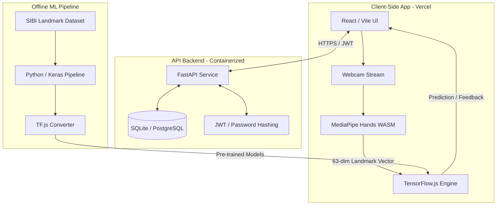

# SIBI Learning Platform

An interactive, real-time sign language recognition and learning platform for **SIBI** (Sistem Isyarat Bahasa Indonesia — Indonesia's standard sign language).

This platform leverages modern client-side computer vision and machine learning to evaluate user-performed hand signs in real-time. By extracting hand keypoints locally on the user's device, the application guarantees low latency, offline-capable inference, and absolute user privacy.

---

## 🏗️ Architectural Overview

The SIBI Learning Platform is designed as a decoupled, modern web application consisting of three distinct layers:

---

## 💻 Tech Stack & Engineering Details

### 1. Frontend & Client-Side Inference (Vite + React + TypeScript)

The user interface is built to be fast, responsive, and secure. Rather than sending raw video frames to a remote server for processing (which causes high latency and bandwidth costs), **all compute is performed locally on the client**:

* **MediaPipe Hands (WASM)**: Captures video frames from the webcam stream and runs an optimized hand-tracking pipeline to extract **21 3D hand landmarks** (a 63-dimensional coordinate vector representing $(x, y, z)$ coordinates).
* **TensorFlow.js (TF.js)**: Runs the pre-trained neural networks directly in the browser's JavaScript runtime, achieving sub-10ms inference times.
* **Fallback Cosine-Similarity Engine**: A mathematical keypoint-similarity classifier that compares user gestures against baseline pose vectors using spatial distances. This acts as an immediate fallback or cold-start engine.

### 2. Machine Learning Pipeline (Python + TensorFlow/Keras)

The classification model operates on hand landmark coordinates instead of raw pixel grids. This approach yields major advantages:

* **Lighting/Skin-Tone Agnostic**: The model is completely invariant to visual noise, background environments, lighting, and skin tones since it only processes normalized mathematical coordinate frames.
* **Ultra-Lightweight Models**: Because the input dimensionality is small ($21 \times 3 = 63$ inputs), the model files are tiny:
  * **Static Alphabet Classifier (CNN/Dense)**: $\approx 30 \text{ KB}$
  * **Dynamic Gesture Classifier (LSTM)**: $\approx 80 \text{ KB}$

| Model Type                   | Architecture                         | Inputs                      | Outputs                   | Purpose                             |
| :--------------------------- | :----------------------------------- | :-------------------------- | :------------------------ | :---------------------------------- |
| **Static Classifier**  | Convolutional / Dense Neural Network | 63-dim landmark vector      | 26 alphabet labels        | Static letters (A–Z)               |
| **Dynamic Classifier** | Long Short-Term Memory (LSTM)        | Sequences of 63-dim vectors | Target word/phrase labels | Conversational gestures & greetings |

### 3. Backend API (FastAPI + SQLAlchemy)

The backend manages data persistence and synchronization, providing a fast, secure API layer:

* **FastAPI**: Structured around asynchronous handlers (`async/await`) for high throughput and automatically generated OpenAPI docs.
* **JWT-Based Authentication**: Implements OAuth2 Password Bearer flow with HMAC-SHA256 signed JWT tokens for secure stateless session management.
* **SQLAlchemy ORM**: Configured to interface with SQLite for development, easily migration-ready for enterprise databases like PostgreSQL.
* **Progress Tracking**: Persists user stats, unlocked modules, and lessons completed.

---

## 🚀 Deployment Strategy

### Frontend (Vercel)

The frontend is optimized for deployment as a static Single Page Application (SPA) on Vercel:

* Client-side routing is supported via rewrite rules in [`vercel.json`](file:///c:/Users/Adji/Documents/SIBI/SIBI-learning/frontend/vercel.json) redirects.
* Static model weights and MediaPipe WASM binaries are served from the static `public/` directory for fast edge-caching on Vercel's CDN.

### Backend (Containerized)

The backend FastAPI service is containerized or deployed to a platform supporting persistent storage (such as Render, Fly.io, or Railway):

* Requires configuration of CORS origins to accept traffic from the Vercel frontend URL.
* Integrates a persistent volume mount when running SQLite to prevent database wipes during container recycles.

### Environment Configuration

The communication between the frontend and backend is configured using standard environment variables:

* **`VITE_API_URL`**: Set on Vercel to point to the live FastAPI URL.
* **`JWT_SECRET`**: Production-grade secret key set on the backend host.
* **`CORS_ORIGINS`**: Set on the backend to match the Vercel deployment URL.
